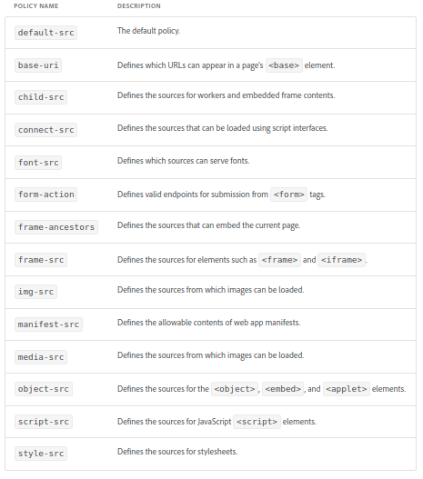

## CSP - Whitelisting

HK2 CSP Whitelisting for Magento version 2.3.5 or Above. HK2 CSP Whitelist some of the major url's like Cloudflare, Google Analytics, Google Fonts, Fontawesome, Addthis, Googleapis, Facebook Graph, Pinterest, Vimeo, Twitter, Trust Pilot.

One can disable Magento 2 CSP. However, Disabling results in more possibilities of attacks on the Magento store. (CSP) are a powerful tool to mitigate against Cross Site Scripting (XSS) and related attacks.

**Please Note** :- This module Whitelist CSP in Magento Store Frontend.

## Account & Pricing

This is a Open Source - Free to use Module. No charge or any fee is there to use it.

## How to Configure?

You can add a domain to the whitelist for a policy (like script-src, style-src, font-src and others) by updating the **csp_whitelist.xml present** in **/app/code/HK2/Csp/etc/csp_whitelist.xml** . Please only create rules for URLs that you have verified as safe & safe for your Magento Store. Ensure that you use a unique "id" (e.g. the URL) for each entry within its group. Below screenshot describes Policy Name & Description.



## Features

Fully Customizable as per your Store needs. Check How to Configure Section for more details.
Open Source & Free

## Some of the URL Whitelisted

1. Addthis (moatads is a part of Addthis)
2. Cloudflare
3. Facebook Graph
4. Fontawesome
5. Google Analytics, Google Fonts, Gstatic, Google Tag Manager & Googleapis
6. Pinterest
7. Trust Pilot
8. Twitter
9. Vimeo
10. ContentSqaure

## Complete List of URL Whitelisted

### scripts-src Whitelisted

```
*.addthis.com
*.googleapis.com
*.cloudflare.com
*.fontawesome.com
*.google.com
*.google-analytics.com
googletagmanager.com
graph.facebook.com
*.gstatic.com
*.moatads.com
*.trustpilot.com
*.vimeo.com
widgets.pinterest.com
*.contentsquare.net
```

### style-src Whitelisted

```
*.cloudflare.com
*.fontawesome.com
*.googleapis.com
*.gstatic.com
*.twitter.com
```

### img-src Whitelisted

```
*.cloudflare.com
data:
*.google-analytics.com
*.paypal.com
*.twitter.com
*.vimeocdn.com
*.contentsquare.net
```

### connect-src Whitelisted

```
*.cloudflare.com
*.paypal.com
*.twitter.com
*.contentsquare.net
```

### font-src Whitelisted

```
*.cloudflare.com
*.fontawesome.com
*.googleapis.com</value>
*.gstatic.com
*.twitter.com
```

### frame-src Whitelisted

```
*.addthis.com
*.google.com
*.trustpilot.com
*.twitter.com
*.vimeo.com
```

## Support:

-   Magento v2.3.5, 2.4.x

## Features

1. Fully Customizable as per your Store needs. Check How to Configure Section for more details.
2. Simple, Open Source & Free
3. CSP is not disabled rather specific listed urls are whitelisted, keeping your Magento Store Safe.

## How to install

### Method 1: Install ready-to-paste package

[Download Link - HK2 - CSP - (https://github.com/basantmandal/HK2-CSP/releases/tag/1.0.2)](https://github.com/basantmandal/HK2-CSP/releases/tag/1.0.2)

Download the zip package and unzip it in app/code folder.

## Enable Extension:

```bash
php bin/magento module:enable HK2_Csp
```

```bash
php bin/magento setup:upgrade
```

```bash
php bin/magento cache:flush
```

## Disable Extension:

```bash
php bin/magento module:disable HK2_Csp
```

```bash
php bin/magentosetup:upgrade
```

```bash
php bin/magento cache:flush
```

### Method 2: Install via composer (Recommend)

Run the following command in Magento 2 root folder

```bash
composer require hk2/csp
```

```bash
php bin/magento setup:upgrade
```

```bash
php bin/magento setup:static-content:deploy
```

## Maintenance mode

You may want to enable the maintenance mode when installing or updating the module, especially when working on a production website. To do so, run the two commands below before and after running the other setup commands:

### Enable Maintenance Mode

```bash
php bin/magento maintenance:enable
```

### Disable Maintenance Mode

```bash
php bin/magento maintenance:disable
```

### Privacy

This extension does not read, change, store, or transmit any of your personal data (e.g., logins, passwords, messages, contacts) from any of the sites or your computer in absolutely any form.

## Support

For support, Please consult the documentation.

## Bug Report

Please open an [issue](https://github.com/basantmandal/HK2-CSP/issues) on GitHub.

When filing a bug remember that the better written the bug is, the more likely it is to be fixed.

You can also reach us at <support@hashtagkitto.co.in>

## Contributing

This project welcomes contributions from the community.

## License

Copyright (c) 2019, 2023 **Basant Mandal (HK2 - Hash Tag Kitto)**

## Consent

By using HK2 ScrollTop Module, you hereby consent to our disclaimer and agree to its terms.

## Disclaimer

> **Basant Mandal (HK2 - Hash Tag Kitto)** does not make any warranties about the completeness, reliability and accuracy of this image or its related products. Any action you take upon the information you find here is strictly at your own risk.

> **Basant Mandal (HK2 - Hash Tag Kitto)** will not be liable for any losses and/or damages in connection with the use of our website.

## Help Us

If you liked my work, Please contribute to make my Open Source Contribution more frequent and help others - [https://www.buymeacoffee.com/basantmandal](https://www.buymeacoffee.com/basantmandal) or [https://www.hashtagkitto.co.in/buymecoffee.php](https://www.hashtagkitto.co.in/buymecoffee.php)
